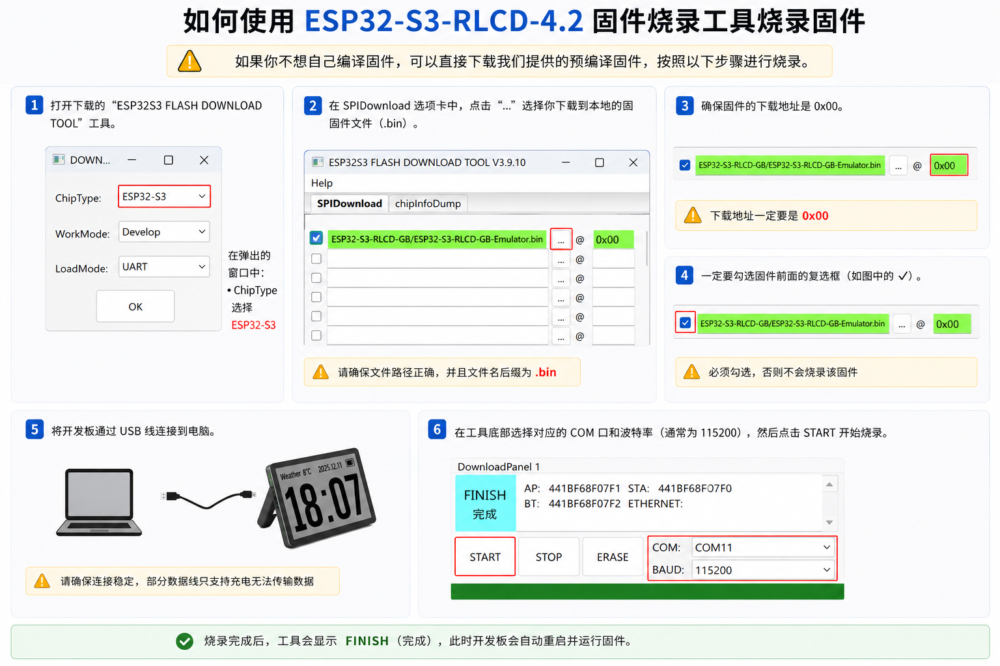

# ESP32-S3 RLCD GB/GBC Emulator

这是一个运行在 **Waveshare ESP32-S3-RLCD-4.2** 开发板上的 Game Boy / Game Boy Color 模拟器。

它可以从 SD 卡读取 `.gb` / `.gbc` 游戏文件，用开发板上的 4.2 寸全反射黑白屏显示画面，并通过手机网页作为无线手柄来操作游戏。

这个项目不是通用 ESP32 模拟器，只针对这块开发板：

- Waveshare ESP32-S3-RLCD-4.2
- ESP32-S3R8N16
- 8MB PSRAM
- 16MB Flash
- 400x300 1-bit RLCD 屏幕
- 板载 SD 卡槽和扬声器

## 直接使用

如果你只是想把开发板刷成游戏机，不需要编译源码，只需要准备 3 样东西：

1. 固件文件
2. 字体文件
3. Espressif 官方烧录工具

### 下载固件

下载这个文件：

[ESP32-S3-RLCD-GB-Emulator-merged.bin](https://github.com/tigerxu255-lgtm/esp32-s3-rlcd-gb-emulator/raw/main/firmware/ESP32-S3-RLCD-GB-Emulator-merged.bin)

这是已经合并好的固件，包含 bootloader、分区表和应用程序。使用 Espressif Flash Download Tool 烧录时，只需要这一行：

```text
0x0    ESP32-S3-RLCD-GB-Emulator-merged.bin
```

### 下载烧录工具

下载 Espressif 官方烧录工具：

[Flash Download Tool](https://dl.espressif.com/public/flash_download_tool.zip)

烧录时建议这样设置：

```text
Chip: ESP32-S3
SPI Mode: DIO
SPI Speed: 80MHz
Flash Size: 16MB
Address: 0x0
```

烧录工具可以参考下面这张图填写：



### 准备字体文件

字体文件是必须放的。当前游戏选择界面的中文、英文、数字和符号都会使用这个字体文件。

如果没有放置字体文件，游戏选择界面的文字显示会不完整或变成 `?`。

下载字体文件：

[font16.bin](https://github.com/tigerxu255-lgtm/esp32-s3-rlcd-gb-emulator/raw/main/font16.bin)

然后在 SD 卡中创建这个目录：

```text
/fonts/
```

把字体文件放进去，最终路径必须是：

```text
/fonts/font16.bin
```

## 准备 SD 卡

建议把 SD 卡格式化成 FAT32。

推荐目录结构：

```text
/GB/
  game1.gb
  game2.gb

/GBC/
  game1.gbc
  game2.gbc

/fonts/
  font16.bin
```

说明：

- `.gb` 是 Game Boy 游戏
- `.gbc` 是 Game Boy Color 游戏
- 游戏 ROM 不随项目提供，请只使用你自己合法拥有的 ROM

## 使用手机手柄

开发板启动后，会创建一个 Wi-Fi 热点：

```text
Wi-Fi: ESP32-GB
密码: 12345678
```

手机连接这个 Wi-Fi 后，用浏览器打开：

```text
http://192.168.4.1
```

手机页面就是手柄。

手柄上可以做这些事：

- 控制方向
- A / B / START / SELECT
- 调节音量
- 查看电量
- 修改按钮位置

### 修改按钮位置

在手机手柄页面点击 `EDIT`，拖动按钮到你喜欢的位置，再点击 `PLAY`。

按钮位置会保存在手机浏览器里，下次打开还会保持。

### 调节音量

手机手柄顶部有音量滑条，拖动即可调节游戏音量。

## 游戏操作

在游戏选择界面：

```text
上 / 下：选择游戏或文件夹
左 / 右：翻页
A：进入文件夹或启动游戏
B：返回上级目录
```

游戏运行时：

```text
摇杆：方向键
A：Game Boy A
B：Game Boy B
START：开始
SELECT：选择
```

开发板上的 GPIO18 按钮用于退出当前游戏，返回游戏选择界面。

## 待机时钟

如果长时间停留在游戏选择界面，屏幕会进入待机时钟界面。

手机打开手柄页面时，会自动把手机时间同步给开发板。这个时间同步只是为了显示时钟，不影响游戏功能。

## 从源码编译

普通用户不需要看这一节。

如果你想自己修改代码，需要安装 ESP-IDF v6.0.1。

```powershell
cd D:\your_path\esp32-s3-rlcd-gb-emulator
. 'C:\Espressif\tools\Microsoft.v6.0.1.PowerShell_profile.ps1'
idf.py build
```

编译完成后，应用固件在：

```text
build/ESP32-S3-RLCD-GB-Emulator.bin
```

如果你想生成一个可以直接烧录到 `0x0` 的合并固件，可以执行：

```powershell
python -m esptool --chip esp32s3 merge-bin `
  -o firmware\ESP32-S3-RLCD-GB-Emulator-merged.bin `
  --flash-mode dio `
  --flash-size 16MB `
  --flash-freq 80m `
  0x0 build\bootloader\bootloader.bin `
  0x8000 build\partition_table\partition-table.bin `
  0x10000 build\ESP32-S3-RLCD-GB-Emulator.bin
```

## 许可证

本项目包含 GPLv2 许可证的 gnuboy 代码，因此项目按 GPLv2 发布。

详见 [LICENSE](LICENSE)。
